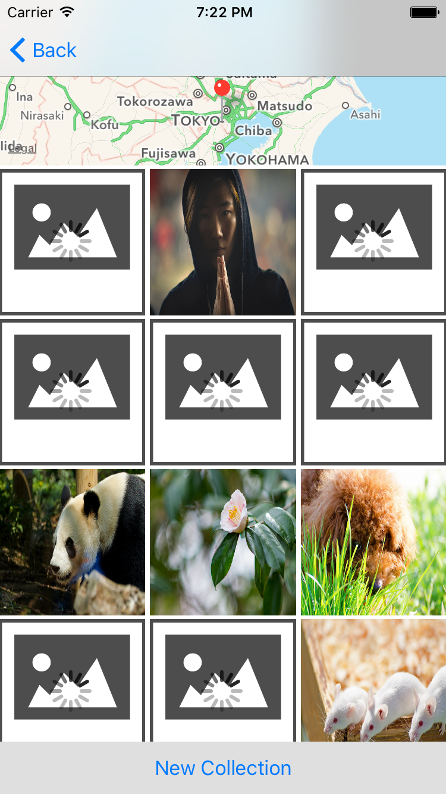
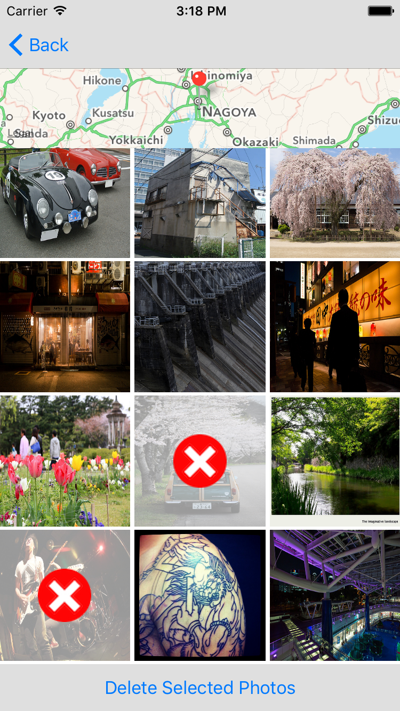

# virtual-tourist
Virtual Tourist is an iOS app that lets you explore the world from the comfort of your couch.

Virtual Tourist is a portfolio project from the Udacity "iOS Persistence and Core Data" course.

Simply drop a pin by tapping and holding at a location of interest.

Tapping a pin downloads interesting Flickr photos that are associated with the latitude and longitude of the location. Photos are displayed as they finish downloading.

Specific photos can be deleted by selecting them, or you can grab a new collection altogether.

